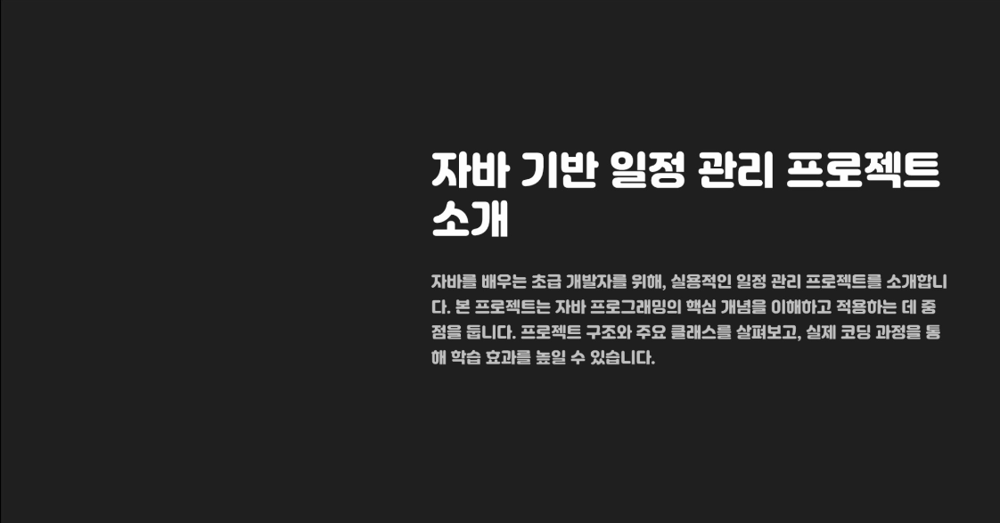

  

# 📅 javaSchedule

  
  
  

## 🚀 프로젝트 소개

**javaSchedule**은 자바로 구현된 일정 관리 애플리케이션입니다.  
이 프로젝트는 자바 프로젝트지만 **client**와 **controller**를 구분하여 사용자가 내부 기능을 알 수 없도록 설계되었습니다.  
효율적인 일정 관리와 깔끔한 구조를 경험해 보세요!

### ✨ 주요 특징
- 📋 **일정 관리**: 일정 추가, 수정, 삭제 기능 제공
- 🔒 **캡슐화**: 내부 로직을 사용자에게 숨김
- 🛠️ **확장 가능**: 모듈화된 구조로 기능 확장 용이

## 📜 문서
자세한 설명과 사용법은 아래 PDF 문서를 확인하세요:  
📥 [**PDF 문서 보기**](./https://github.com/donggonyoo/javaSchedule/blob/main/%EC%9E%90%EB%B0%94%ED%94%84%EB%A1%9C%EC%A0%9D%ED%8A%B8%20%EC%B5%9C%EC%A2%85.pdf)

## 🛠️ 기술 스택
| **기술**      | **버전** |
|---------------|----------|
| Java          | 17       |

## 📞 연락처
궁금한 점이 있으시면 아래로 연락 주세요:  
📧 **ddkk8525@gmail.com**

---

  <i>이 프로젝트는 지속적으로 개선 중입니다. 많은 관심 부탁드립니다! 🌟</i>

